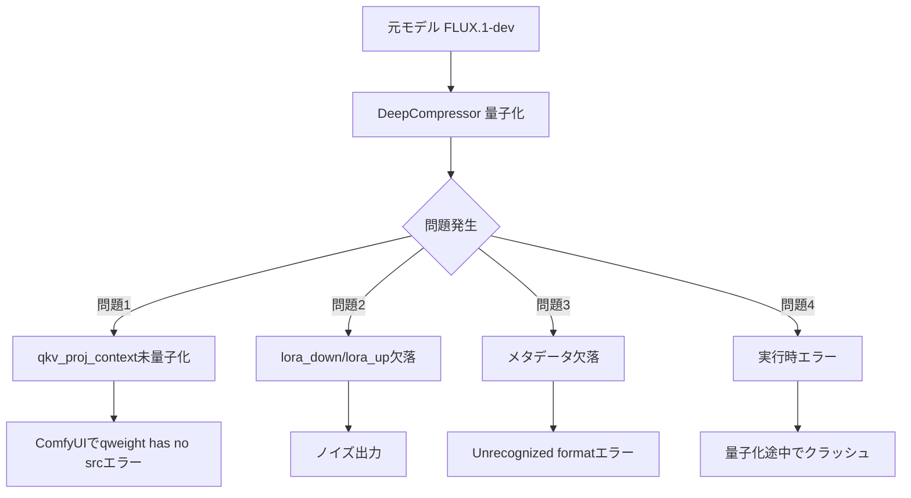

# FLUX Nunchaku r128 SVDQ-FP4 量子化修正 完全解説書

**作成日**: 2026-01-06  
**対象モデル**: FLUX.1-dev r128 SVDQ-FP4

---

## 概要

DeepCompressorを使用してFLUX.1-devモデルをNunchaku r128 SVDQ-FP4形式に量子化する際に発生した複数の問題と、その解決策を包括的にまとめた技術文書です。

---

## 問題の全体像



---

## 修正1: `qkv_proj_context` 量子化漏れの修正

### 問題の詳細

FLUXモデルの `JointAttention` では、テキスト（T5）側のプロジェクション層として `add_q_proj`, `add_k_proj`, `add_v_proj` が存在します。これらは `qkv_proj_context` としてエクスポートされるべきですが、量子化されずにBF16のまま残っていました。

### 根本原因

[weight.py](file:///d:/nu/deepcompressor/deepcompressor/app/diffusion/quant/weight.py) の QKV グループ検出ロジックが `add_q_proj` を認識していませんでした。

**修正前のコード（84-86行目付近）:**
```python
if field_name in ("q_proj", "to_q"):
    modules, module_names = parent.qkv_proj, parent.qkv_proj_names
# add_q_proj のケースが欠落していた
```

### 修正内容

**修正後のコード（87-94行目）:**
```python
elif field_name in ("add_q_proj",) and parent.add_q_proj is not None:
    # add_q_proj starting point for joint attention add_qkv_proj group
    modules, module_names = parent.add_qkv_proj, parent.add_qkv_proj_names
elif field_name in ("add_k_proj", "add_v_proj"):
    # add_k_proj and add_v_proj are handled by add_q_proj
    continue
```

### 影響範囲

- `calibrate_diffusion_block_low_rank_branch` 関数（85-94行目）
- `quantize_diffusion_block_weights` 関数（325-338行目）

---

## 修正2: Low-Rank Branch (lora_down/lora_up) エクスポート漏れの修正

### 問題の詳細

SVDQuantでは、重み行列 $W$ を以下のように分解します：

$$W \approx L + R$$

- **L (Low-Rank Branch)**: `lora_down @ lora_up` で計算される高精度部分
- **R (Residual)**: `qweight` として FP4 量子化された残差部分

`lora_down`/`lora_up` が欠落すると、重みの大部分が失われてノイズ出力になります。

### 根本原因

[convert.py](file:///d:/nu/deepcompressor/deepcompressor/backend/nunchaku/convert.py) の branch 取得ロジックが、融合された QKV グループのキー形式を誤解していました。

**問題のメカニズム:**

1. `weight.py` では、融合された QKV グループの branch を**最初のモジュール名のみ**に保存
   - 例: `transformer_blocks.0.attn.to_q` （`to_k`, `to_v` ではなく）
   - 例: `transformer_blocks.0.attn.add_q_proj` （`add_k_proj`, `add_v_proj` ではなく）

2. `convert.py` の元のコードは3つ全てを検索し、1つでも見つからないと全て破棄
   ```python
   # 元のコード（問題あり）
   branches = [branch_dict.get(f"{block_name}.{bn}", None) for bn in branch_names]
   if any(b is None for b in branches):
       branch = None  # ← 全て破棄してしまう！
   ```

### 修正内容

**修正後のコード（221-253行目）:**
```python
# Low-rank branch (SVDQuant) handling:
# - DeepCompressor stores branches for fused QKV groups under the FIRST module name only
#   (e.g. "attn.to_q" for qkv_proj, "attn.add_q_proj" for qkv_proj_context).
branch_names = branch_name_map.get(converted_local_name, "")
if isinstance(branch_names, list):
    # For fused QKV, branch is stored under the FIRST name only (the "q" projection)
    first_branch_name = branch_names[0]
    first_branch = branch_dict.get(f"{block_name}.{first_branch_name}", None)
    if first_branch is not None:
        # Branch exists under the first name - this is the fused branch
        branch = (first_branch["a.weight"], first_branch["b.weight"])
    else:
        # Fallback to legacy approach...
```

---

## 修正3: ComfyUI互換メタデータの追加

### 問題の詳細

Nunchaku ローダーは `.safetensors` ファイル内に特定のメタデータを必要とします。

### 修正内容

[ptq.py](file:///d:/nu/deepcompressor/deepcompressor/app/diffusion/ptq.py) に以下のメタデータ生成ロジックを追加：

```python
metadata = {
    "model_class": "NunchakuFluxTransformer2dModel",
    "config": json.dumps(transformer_cfg),
    "quantization_config": json.dumps(qcfg),
    "comfy_config": comfy_config,  # ComfyUI用設定
}
```

---

## 修正4: 実行時エラーの修正

### 4.1 `scale` NoneType エラー

**ファイル**: [convert.py](file:///d:/nu/deepcompressor/deepcompressor/backend/nunchaku/convert.py)  
**問題**: 一部の scale が `None` の場合に `AttributeError` が発生  
**修正**: `None` を検出してフィルタリング/フォールバック処理を追加

### 4.2 `FluxSingleTransformerBlock` 出力形式エラー

**ファイル**: [calib.py](file:///d:/nu/deepcompressor/deepcompressor/app/diffusion/dataset/calib.py)  
**問題**: 出力が tuple の場合に `AssertionError` が発生  
**修正**: tuple/tensor 両方に対応するように条件分岐を追加

### 4.3 `image_rotary_emb` サイズ不整合エラー

**ファイル**: [calib.py](file:///d:/nu/deepcompressor/deepcompressor/app/diffusion/dataset/calib.py)  
**問題**: single_transformer_blocks で `image_rotary_emb` のサイズ不整合  
**修正**: kwargs から `image_rotary_emb` を除去

---

## 修正5: `.gitignore` の修正

### 問題の詳細

`nunchaku/` パターンが `deepcompressor/backend/nunchaku/` にも誤ってマッチしていました。

### 修正内容

```diff
- nunchaku/
- ComfyUI-nunchaku/
+ /nunchaku/
+ /ComfyUI-nunchaku/
```

先頭の `/` によりルートディレクトリのみにマッチするように変更。

---

## キャッシュに関する重要な注意事項

> [!CAUTION]
> **古いキャッシュを使用すると、修正が適用されません！**

`ptq.py` はキャッシュディレクトリに `branch.pt` を保存し、次回実行時に再利用します。修正前に作成されたキャッシュを使用すると、`lora_down`/`lora_up` が欠落したままになります。

### 必須のキャッシュ削除コマンド

```bash
# 方法1: branch.pt のみ削除（最小限）
find . -name "branch.pt" -delete

# 方法2: 全キャッシュを削除（推奨）
rm -rf cache/
rm -rf exps/*/
```

---

## 検証スクリプト

### verify_lora_complete.py

量子化の各段階を検証するスクリプトを作成しました。

```bash
# branch.pt の中身を確認
python verify_lora_complete.py --branch-pt <path_to_branch.pt>

# 最終出力を確認
python verify_lora_complete.py --output <path_to_output.safetensors>

# 両方確認
python verify_lora_complete.py --both --branch-pt <path> --output <path>
```

**期待される出力例:**
```
[OK] qkv_proj (block 0): a.weight=[3072, 128], b.weight=[9216, 128]
[OK] qkv_proj_context (block 0): a.weight=[3072, 128], b.weight=[9216, 128]
[OK] single_qkv_proj (block 0): a.weight=[3072, 128], b.weight=[9216, 128]
...
[SUCCESS] All checks passed!
```

---

## 再量子化の完全手順

### Step 1: 最新コードの取得

```bash
cd /path/to/deepcompressor
git pull
```

### Step 2: キャッシュの完全削除

```bash
rm -rf cache/
rm -rf exps/*/
# または
find . -name "*.pt" -path "*/cache/*" -delete
find . -name "*.pt" -path "*/exps/*" -delete
```

### Step 3: 量子化の実行

```bash
python -m deepcompressor.app.diffusion.ptq \
    --model-path <path_to_flux_model> \
    --config <config.yaml> \
    --export-nunchaku-flux \
    ...
```

### Step 4: エクスポート後の検証

```bash
python verify_lora_complete.py --output <output.safetensors>
```

### Step 5: ComfyUI での動作確認

検証スクリプトが `[SUCCESS]` を返した場合にのみ、ComfyUI での読み込みをテストしてください。

---

## コミット履歴

| コミット | 内容 |
|---------|------|
| `71ffbe6` | `add_q_proj` グループ開始の修正 |
| `92b7982` | `.gitignore` からサブモジュール除外 |
| `a0266b6` | 検証スクリプト追加 |
| `232aa92` | branch lookup の first module name 修正 |
| `e8225aa` | 包括的 lora 検証スクリプト追加 |

---

## まとめ

| 問題 | 原因 | 修正ファイル |
|------|------|-------------|
| `qkv_proj_context` 未量子化 | `add_q_proj` 未認識 | `weight.py` |
| `lora_down`/`lora_up` 欠落 | branch lookup ロジック不正 | `convert.py` |
| メタデータ欠落 | エクスポート時に未生成 | `ptq.py` |
| 実行時エラー各種 | 例外ケース未対応 | `calib.py`, `convert.py` |
| 修正反映されない | 古いキャッシュ使用 | **手動削除が必要** |

**全ての修正は GitHub にプッシュ済みです。Vast.ai で `git pull` 後、必ずキャッシュを削除してから再量子化を実行してください。**
